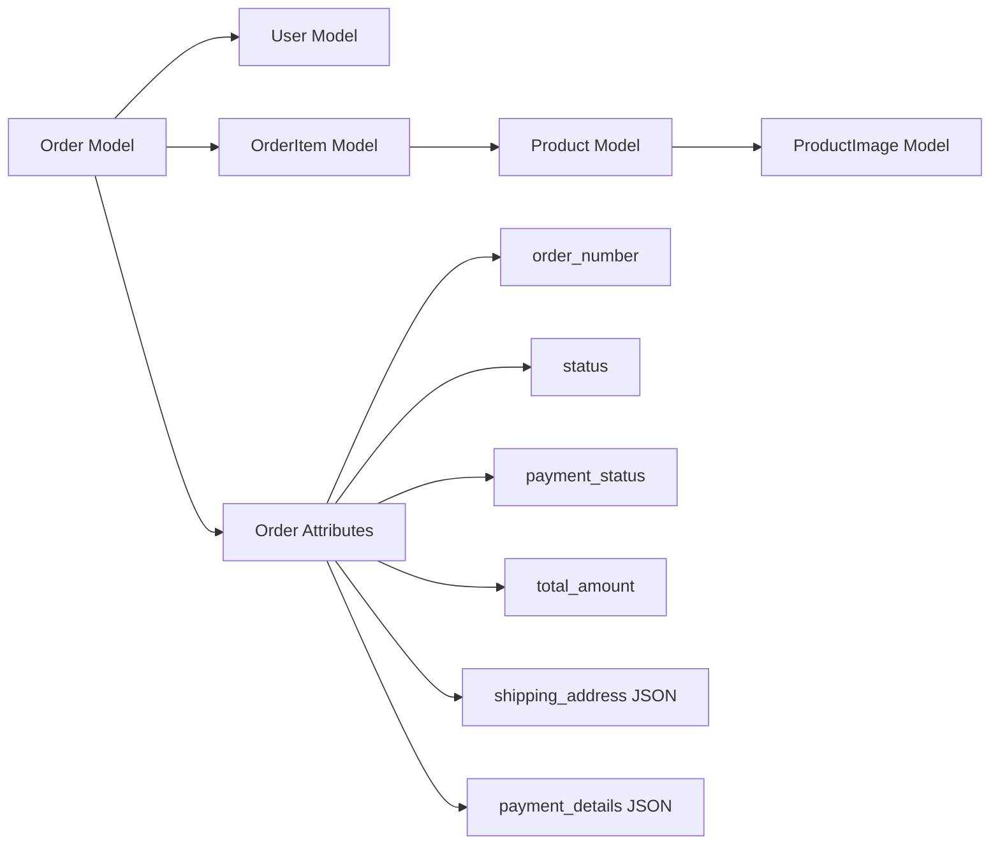
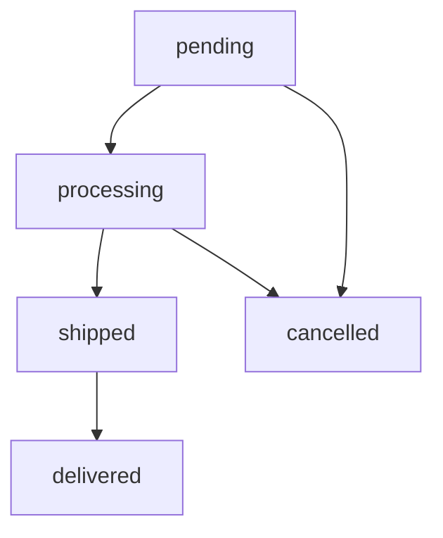
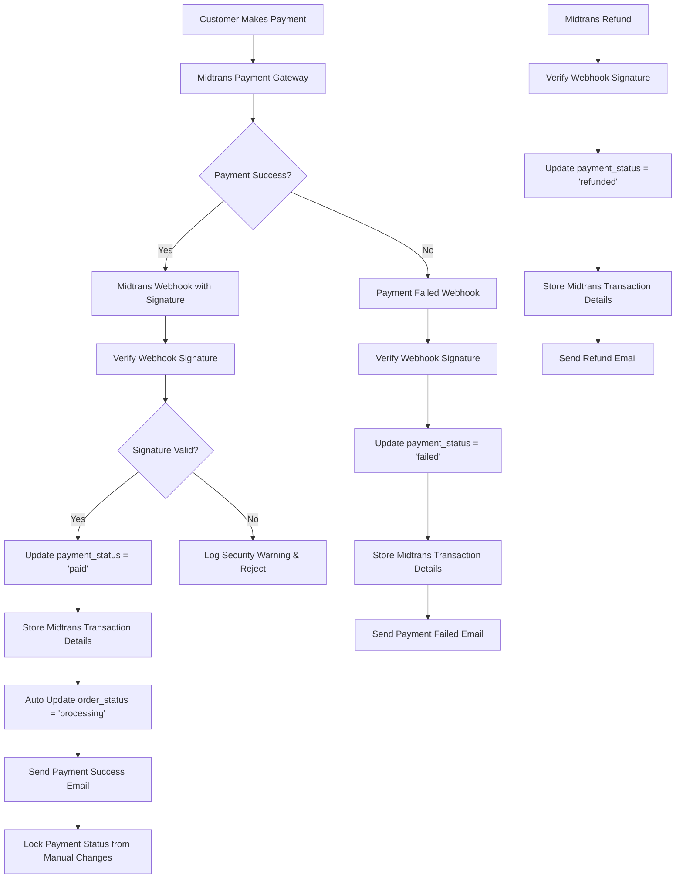
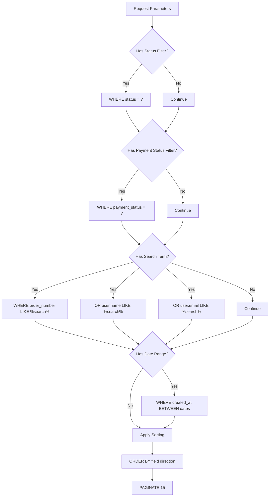
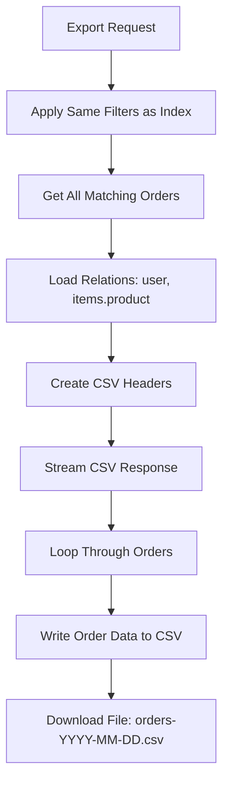

# Admin Orders Data Flow - https://geraisepatu.xyz/admin/orders

## Main Data Flow Flowchart

```mermaid
flowchart TD
    A[Admin Access /admin/orders] --> B[OrderController@index]
    B --> C{Apply Filters?}
    
    C -->|Yes| D[Filter by Status]
    C -->|Yes| E[Filter by Payment Status]
    C -->|Yes| F[Filter by Search Term]
    C -->|Yes| G[Filter by Date Range]
    
    D --> H[Query Builder]
    E --> H
    F --> H
    G --> H
    C -->|No| H
    
    H --> I[Apply Sorting]
    I --> J[Paginate Results (15 per page)]
    J --> K[Load Order Relations]
    K --> L[Return Orders View]
    
    L --> M[Display Orders Table]
    M --> N{Admin Action?}
    
    N -->|View Details| O[OrderController@show]
    N -->|Update Order Status| P[OrderController@updateStatus]
    N -->|Generate Invoice| R[OrderController@invoice]
    N -->|Export CSV| S[OrderController@export]
    
    O --> T[Load Order with Relations]
    T --> U[Display Order Details]
    
    P --> V[Validate Order Status Update]
    V --> W[Update Order Status in Database]
    W --> X[Send Email Notification]
    X --> Y[Redirect with Success]
    
    R --> FF[Load Order with Items & Products]
    FF --> GG[Generate Invoice View]
    
    S --> HH[Apply Export Filters]
    HH --> II[Generate CSV File]
    II --> JJ[Stream Download Response]
```

## Database Relations Flow



## Order Status Flow



## Payment Status Flow (Midtrans Automatic)



## Filter & Search Flow



## Email Notification Flow

```mermaid
flowchart TD
    A[Order Status Update by Admin] --> B{Status = 'delivered'?}
    B -->|Yes| C[Send OrderDeliveredMail]
    B -->|No| D[Log Status Change]
    
    C --> E[Mail::to(customer_email)]
    E --> F[Queue Email Job]
    
    G[Midtrans Payment Success] --> H[Send PaymentSuccessMail]
    H --> I[Mail::to(customer_email)]
    I --> J[Queue Email Job]
    
    K[Midtrans Payment Failed] --> L[Send PaymentFailedMail]
    L --> M[Mail::to(customer_email)]
    M --> N[Queue Email Job]
```

## Export CSV Flow



## Key Data Points

### Order Statuses
- `pending` - Menunggu
- `processing` - Diproses  
- `shipped` - Dikirim
- `delivered` - Terkirim
- `cancelled` - Dibatalkan

### Payment Statuses
- `pending` - Menunggu
- `paid` - Dibayar
- `failed` - Gagal
- `refunded` - Dikembalikan

### Payment Methods
- QRIS, GoPay, OVO, DANA, ShopeePay
- Bank BCA, Mandiri, BRI, BNI
- Cash on Delivery (COD)

### Key Features
- Real-time filtering and search
- Bulk export to CSV
- Email notifications for status changes
- Invoice generation
- **Automatic payment validation via Midtrans**
- Order tracking and management

### Midtrans Integration
- **Automatic Payment Validation**: Payment status updated automatically via secure webhook
- **Signature Verification**: All webhooks verified with SHA512 signature for security
- **IP Whitelist Protection**: Webhook endpoint protected by Midtrans IP whitelist
- **Transaction Details Storage**: Complete Midtrans transaction data stored for audit
- **Manual Override Prevention**: Admin cannot manually change Midtrans-validated payment status
- **Real-time Email Notifications**: Automatic email sent for payment success/failure
- **Automatic Order Progression**: Order status automatically updated (pending → processing when paid)
- **Audit Trail**: All Midtrans updates logged with timestamps and transaction details